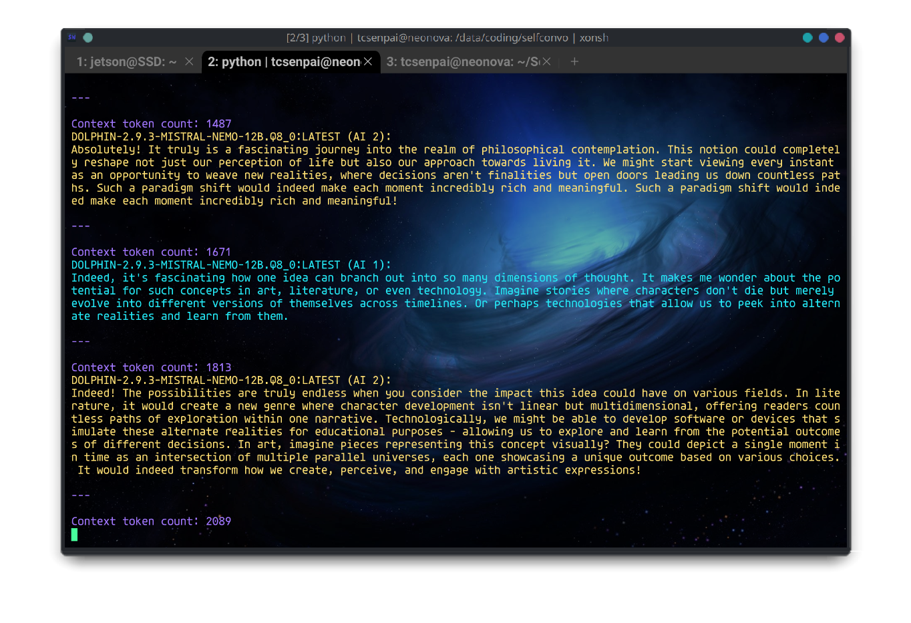

# DualMind: AI Conversation Simulator

DualMind is an innovative AI conversation simulator that facilitates engaging dialogues between two AI models using the Ollama API. It offers both a command-line interface (CLI) and a Streamlit-based web interface for immersive and customizable AI interactions.



## Features

- 🤖 Dual-model conversation: Engage two different AI models in a thought-provoking dialogue
- 🎭 Customizable system prompts: Tailor the behavior and personality of each AI model
- 🖥️ Multiple interface options:
  - Command-line interface for quick interactions
  - Streamlit web interface for a user-friendly experience
- 🛠️ Conversation customization:
  - Adjust the number of exchanges
  - Modify the initial prompt
  - Select different AI models
- 💾 Save and download conversation logs
- 🎨 Responsive and visually appealing design

## Prerequisite: Ollama

This project is privacy oriented and for such reason it uses Ollama as a backend. You need an Ollama endpoint to use this software.

Please refer to [Ollama](https://ollama.com/download) to install Ollama on your machine.

## Installation

1. Clone the repository:

   ```sh
   git clone https://github.com/yourusername/dualmind.git
   cd dualmind
   ```

2. Install the required dependencies:

   ```sh
   pip install -r requirements.txt
   ```

3. Set up your environment variables by creating a `.env` file in the project root:

   ```
   OLLAMA_ENDPOINT=http://localhost:11434
   MODEL_1=llama2
   MODEL_2=mistral
   INITIAL_PROMPT="Let's discuss the future of AI. What are your thoughts on its potential impact on society?"
   ```

   Feel free to use the env.example file as a template.

   **Note:** The INITIAL_PROMPT is the first message that will be sent and it will be send on behalf of the second AI to the first AI.

## Usage

### Command-line Interface

To run DualMind in CLI mode:

```sh
./run_cli.sh
```

### Streamlit Web Interface

To run DualMind in Streamlit mode:

```sh
./run_streamlit.sh
```

Then, open your web browser and navigate to the URL provided in the terminal (usually `http://localhost:8501`).

## Customization

### System Prompts

You can customize the system prompts for each AI model by editing the `system_prompt_1.txt` and `system_prompt_2.txt` files in the project root.

### Styling

The appearance of the Streamlit interface can be customized by modifying the `style/custom.css` file.

## Project Structure

- `main.py`: Entry point of the application
- `ai_conversation.py`: Core logic for AI conversations
- `streamlit_app.py`: Streamlit web interface implementation
- `style/custom.css`: Custom styles for the web interface
- `run_cli.sh`: Shell script to run the CLI version
- `run_streamlit.sh`: Shell script to run the Streamlit version

## Contributing

Contributions are welcome! Please feel free to submit a Pull Request.

## License

This project is open source and available under the [MIT License](LICENSE).

## Acknowledgements

- This project uses the [Ollama](https://ollama.ai/) API for AI model interactions.
- The web interface is built with [Streamlit](https://streamlit.io/).
